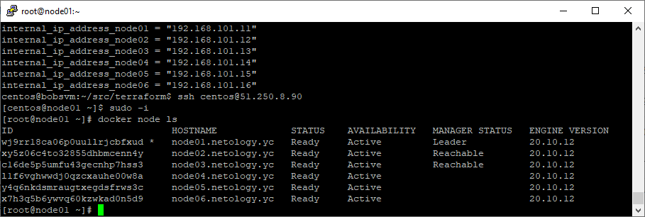
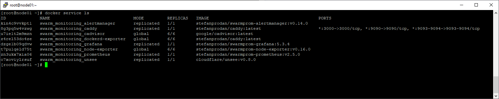

# Домашнее задание к лекции - 5.5

## Задача 1.

- В чём отличие режимов работы сервисов в Docker Swarm кластере: replication и global?

В режиме replication кол-во сервисов указывает администратором, на отдельной ноде может быть как несколько сервисов, так и вовсе ниодного.
В режиме global сервис распространяется на все ноды в одном экземпляре.

- Какой алгоритм выбора лидера используется в Docker Swarm кластере?

В Docker Swarm кластере используется алгоритм консенсуса Raft

- Что такое Overlay Network?

VPN L2 сеть по технологии vxlan между хостами кластера Docker Swarm

## Задача 2.

## Задача 3.

