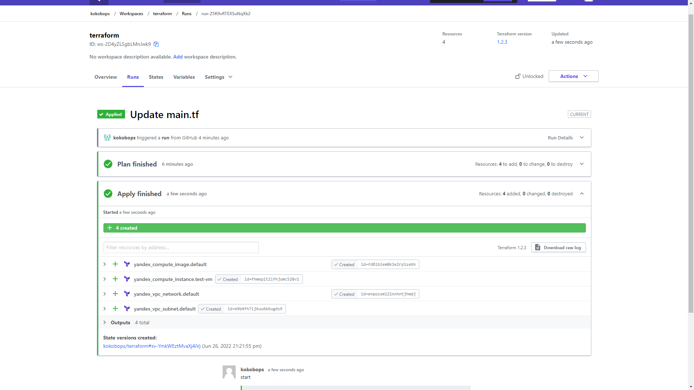

# Домашнее задание к занятию - 7.4

## Задание 1.

## Задание 2.

[server.yaml](https://github.com/kokobops/devops-netology/blob/main/Terraform/server.yaml)

[atlantis.yaml](https://github.com/kokobops/devops-netology/blob/main/Terraform/atlantis.yaml)

## Задание 3.

Возможно буду использовать. Модуль позволяет автоматически создавать папки и сети.

[vpc_yandex.tf](https://github.com/kokobops/devops-netology/blob/main/Terraform/vpc_yandex.tf)