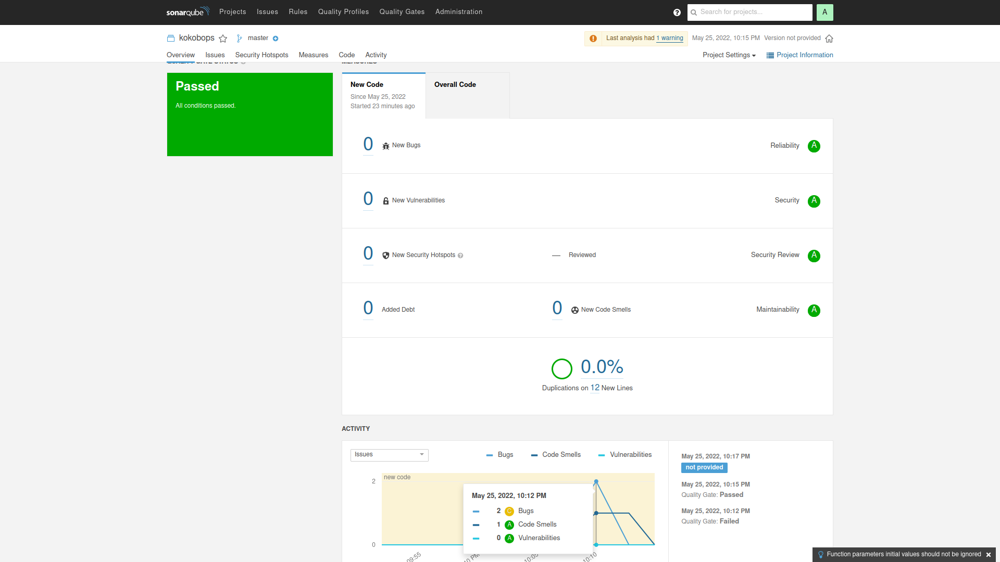

# Домашнее задание к лекции - 9.2

## SonarQube.

## Nexus.

[a link](https://github.com/kokobops/devops-netology/blob/main/maven-metadata.xml)

## Maven.

[a link](https://github.com/kokobops/devops-netology/blob/main/pom.xml)